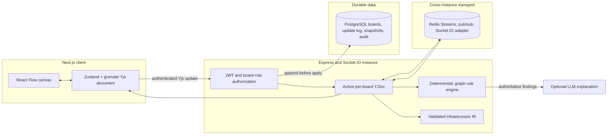

# System Synthesis

System Synthesis is a collaborative architecture-modeling engine. It represents a system diagram as a versioned graph that authorized teams can edit together, lint deterministically, inspect semantically, and export into a documented infrastructure subset.

The technical core is not the optional LLM integration. It is the combination of board-scoped authorization, granular Yjs state, durable ordered updates, deterministic graph analysis, reproducible export, and semantic history.

## What the project guarantees

These claims are intentionally limited to behavior covered by the repository's automated checks.

| Guarantee | Scope and evidence |
| --- | --- |
| Protected boards can only be mutated by an owner or editor | Identity comes from a verified JWT; every socket mutation rechecks board role and joined room. Adversarial socket tests and the API/WebSocket integration script cover viewer, cross-board, malformed, and oversized mutations. |
| Independent fields on the same node can merge | Nodes and edges use nested Yjs maps rather than whole-object replacement. Unit tests cover concurrent rename plus movement and user-local undo that preserves remote edits. |
| Accepted collaboration updates are durable before broadcast | PostgreSQL mode appends a hash-deduplicated update under a per-board advisory lock before applying it to the room document. Redis Streams and pub/sub distribute accepted updates. |
| Duplicate and reordered Yjs updates are safe in the tested model | The seeded convergence harness delivers duplicates, delays, reordered updates, local undo, two logical server documents, and a simulated server restart, then compares canonical hashes. |
| Architecture findings are deterministic | The rule engine implements graph algorithms and configurable rules. An LLM can explain the resulting finding set but cannot add, remove, or change findings. |
| Supported exports are reproducible | A validated infrastructure IR, stable ordering, pinned provider/image versions, provenance hashes, explicit unsupported-resource errors, and golden tests cover Docker Compose and Terraform generation. |
| Checkpoint numbering is race-safe | Version allocation, parent selection, semantic diff calculation, and insertion share one PostgreSQL transaction and per-board advisory lock. A concurrent-writer test verifies distinct versions. |

The [benchmark report](./docs/BENCHMARKS.md) separates CRDT simulation from live Socket.IO latency. It does not claim unmeasured production capacity.

## Non-goals

- It is not a formal proof that an architecture is correct.
- It is not a complete replacement for Terraform, Docker Compose, or Kubernetes.
- It is not offline-first. Editing pauses when the socket is disconnected.
- It does not promise conflict-free intent when two users edit the same scalar field; Yjs resolves that field deterministically.
- LLM output is not validation and is never allowed to define the deterministic finding set.
- The in-memory development mode is not restart-durable or horizontally scalable.

## Architecture



### Consistency model

- The active state is a Yjs document with `nodes` and `edges` roots. Each graph entity is a nested `Y.Map`, so movement, label, configuration, and metadata are separate conflict units.
- Different fields merge independently. Concurrent writes to the same scalar field use Yjs conflict resolution; the product does not claim semantic intent merging for that case.
- In PostgreSQL mode, accepted updates enter an append-only, hash-deduplicated log before room application and broadcast. Snapshots compact the log under the same per-board transaction lock.
- A joining or restarted server restores the latest document snapshot and then replays its ordered tail. Redis transport recovery triggers durable replay into loaded rooms.
- `Y.UndoManager` tracks local origins only, so one user's undo does not reverse another user's operation.
- Version restore appends a durable reset update and sends a full-state replacement to connected clients. The restored state itself becomes a new, attributable checkpoint.

See [ADR-001](./docs/adrs/001-yjs-and-conflict-granularity.md), [ADR-002](./docs/adrs/002-durable-update-log.md), [ADR-003](./docs/adrs/003-authoritative-document-state.md), and [ADR-004](./docs/adrs/004-user-local-undo.md).

### Security model

- REST and socket identities come from signed HS256 JWTs with fixed issuer and audience. Query-string and client-supplied identity values are not trusted.
- Roles are `owner`, `editor`, and `viewer`. Every mutation verifies the current role again, the joined room, and the payload board ID.
- Board event schemas use Zod. Yjs updates are limited to 128 KiB, the Socket.IO buffer to 256 KiB, and JSON requests to 1 MiB.
- REST and socket event rate limits are identity/socket scoped.
- Invitations use random, hashed, time-limited, single-use tokens. They do not expose owner identifiers.
- Joins, denied mutations, permission changes, exports, AI explanations, version actions, and other sensitive operations create audit records.

The complete assumptions and residual risks are in [the threat model](./docs/THREAT_MODEL.md).

## Deterministic architecture intelligence

The graph engine implements reachability, reverse reachability, Tarjan strongly connected components, cycle detection, articulation points, bridges, dependency layers and depth, blast radius, trust-boundary crossings, orphan detection, and redundant-path checks.

Rules have stable IDs, severity, applicability, rationale, optional references, and independent tests. Callers can enable or disable rules, override severity, and suppress a finding only with a justification. Results can be exported as JSON or SARIF.

The processing order is:

```text
graph -> deterministic algorithms and rules -> authoritative findings -> optional LLM explanation
```

## Infrastructure export and history

Docker Compose and Terraform exporters consume a schema-validated intermediate representation. Generation uses stable names and ordering, secret placeholders, explicit unsupported-feature errors, source hashes, provider/version pinning, and golden-file tests. The UI can preview semantic IR differences before export.

Version checkpoints record a name, actor ID and display name, parent, optional source version, graph data, and a machine-readable semantic diff. The UI surfaces changes such as added components, removed connections, renamed nodes, moved nodes, and replica-count changes. Authorized users can duplicate from any visible version; only owners can restore.

See [ADR-005](./docs/adrs/005-deterministic-lint-before-llm.md) and [ADR-006](./docs/adrs/006-reproducible-infrastructure-export.md).

## Run locally

Requirements: Node.js 20 or newer, npm, and optionally Docker. PostgreSQL is required for durable history and restart recovery. Redis is required for live cross-instance distribution.

### Full development stack

```bash
docker compose -f docker-compose.dev.yml up --build
```

The development compose file starts PostgreSQL 16, Redis 7, the server on port 4000, and the frontend on port 3000. Its default credentials are for local development only.

### Run the workspaces directly

```bash
npm install
docker compose -f docker-compose.dev.yml up -d postgres redis
```

Copy `server/.env.example` to `server/.env`, configure `DATABASE_URL`, `REDIS_URL`, and `JWT_SECRET`, then run these in separate terminals:

```bash
npm run dev --workspace server
npm run dev --workspace frontend
```

The frontend uses `NEXT_PUBLIC_SOCKET_URL=http://localhost:4000`. Light mode is the default; an explicit light/dark choice is stored in `localStorage` and applied before paint.

### Development-only memory mode

The server can start without PostgreSQL or Redis. That mode is useful for UI work and CI integration checks, but board data and collaboration updates disappear on process exit, semantic history is unavailable, and there is no cross-instance coordination.

## Verification

```bash
# Type-check and create both production builds, then run the backend suite
npm run verify

# Authenticated REST + Socket.IO integration; requires a running built server
npm run test:integration

# Seeded randomized CRDT/property harness
npm run test:convergence

# Live propagation benchmark; requires a running built server
npm run benchmark:socket
```

The current backend suite contains 64 tests across security, collaboration durability and failure policy, graph convergence, granular Yjs behavior, validation algorithms, deterministic export, AI provenance, and transactional history. CI also builds both applications and runs the authenticated integration script with a non-zero failure exit.

## Failure behavior

The short version is: reject a mutation when durability cannot be established, preserve idempotence on duplicate delivery, replay durable state after restart or transport recovery, and never silently treat an LLM response as validation. See [the failure model](./docs/FAILURE_MODEL.md) and [known limitations](./docs/KNOWN_LIMITATIONS.md) for exact cases.

## Deployment shape

The frontend is a normal Next.js application. The collaboration backend requires a long-running Node.js/Socket.IO process plus PostgreSQL, and Redis for multi-instance live distribution. This repository is not currently packaged as a Cloudflare Workers/Sites application and contains no `.openai/hosting.json`; migrating it to that runtime is a separate hosting project, not a failed publish attempt.

## Repository map

- `frontend/` — Next.js UI, React Flow editor, Yjs/Zustand state, persisted theme.
- `server/` — REST/socket authorization, durable collaboration, graph analysis, export, history, tests and benchmarks.
- `shared/` — shared graph, role, operation, and socket event types.
- `docs/` — threat/failure models, benchmark evidence, ADRs, and limitations.
- `test_phases.mjs` — authenticated end-to-end API and WebSocket checks.

## License

MIT
