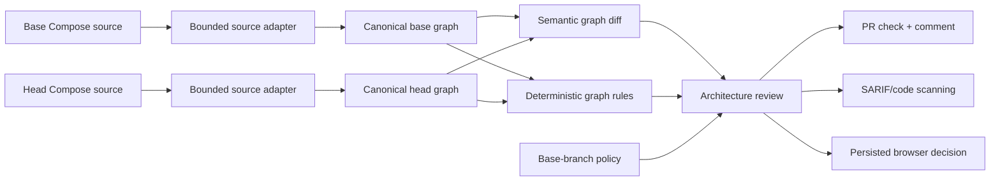

# System Synthesis

System Synthesis is architecture change intelligence for pull requests.

It imports a deliberately supported Docker Compose subset, builds canonical architecture graphs for the base and head revisions, computes a semantic system diff, runs deterministic graph policy, and publishes the result as a PR check, readable comment, JSON, and source-linked SARIF.

The browser product persists the same review model so a team can inspect impact, accept a scoped exception with justification, and approve or reject the change with an audit trail.

The collaborative canvas still exists, but it is no longer the main claim. It is a supporting surface for architecture modeling, inspection, durable history, and export.

## The problem

Code review shows text. Many important architecture changes are hidden inside that text:

- a new host-facing endpoint
- a public service directly depending on persistence
- a new trust-boundary crossing
- reduced replica count
- an expanded downstream blast radius
- a removed dependency or component

Static diagrams rarely participate in the merge decision and drift from source. LLM-only reviews are difficult to reproduce and unsafe as required checks.

System Synthesis answers a narrower question:

> What architecture changed in this pull request, and did the change introduce a policy violation?

## Demonstration

The included example changes a checkout service so it publishes a host port and directly depends on PostgreSQL.

```bash
npm ci
npm run build --workspace=architecture-core
npm run build --workspace=architecture-cli

node architecture-cli/dist/bin.js review \
  --base examples/architecture-review/base/compose.yaml \
  --head examples/architecture-review/head/compose.yaml \
  --source-path compose.yaml \
  --base-revision main \
  --head-revision feature/checkout-db \
  --policy examples/architecture-review/policy.json \
  --format markdown
```

The command exits 1 because the example deliberately violates policy. It reports the added dependency, new trust crossing, increased blast radius, source evidence, and blocking deterministic finding.

Formats:

```bash
--format json
--format markdown
--format sarif
```

Exit codes:

| Code | Meaning |
| ---: | --- |
| 0 | Valid input; policy passed |
| 1 | Valid input; blocking architecture findings introduced |
| 2 | Invalid command, policy, or source |

## Pull-request workflow

The root [`action.yml`](./action.yml) is a bundled Node 24 action. Consumer repositories do not install this monorepo or run dependency lifecycle scripts.

```yaml
- name: Architecture review
  id: architecture
  uses: your-org/System-Synthesis@<pinned-commit-sha>
  continue-on-error: true
  with:
    compose-path: compose.yaml
    policy-path: .system-synthesis/policy.json
    base-revision: ${{ github.event.pull_request.base.sha }}
    head-revision: ${{ github.event.pull_request.head.sha }}
```

The included [dogfood workflow](./.github/workflows/architecture-review.yml):

- compares exact base/head Git objects
- reads policy from the base commit so a PR cannot disable its own check
- uploads source-linked SARIF through GitHub's CodeQL upload action
- creates or updates one marker-based PR comment
- appends the report to the job summary
- preserves JSON, Markdown, and SARIF as an artifact
- enforces the analyzer exit code only after publishing results

GitHub documents third-party SARIF upload and code-scanning availability in its [official integration guide](https://docs.github.com/en/code-security/how-tos/find-and-fix-code-vulnerabilities/integrate-with-existing-tools/upload-sarif-file).

## Browser review

Open `/reviews` to:

1. import base and proposed Compose content
2. inspect resource and connection changes
3. review exposure, trust-boundary, redundancy, and blast-radius impact
4. inspect new, resolved, and blocking findings with file/line evidence
5. accept an exception with justification, ADR/ticket, and optional expiry
6. approve only after the gate passes, or reject with a note
7. inspect the append-only decision timeline

Review mutations use optimistic concurrency. A stale browser tab receives HTTP 409 instead of overwriting a newer decision. An approval attempt with blocking findings receives HTTP 422.

## How it works



Stable identities come from source addresses such as `services.checkout`, not array order or source line. Revision and line metadata remain evidence but are excluded from semantic equality, so reformatting alone produces no architecture change.

The graph engine calculates reachability, reverse reachability, strongly connected components, cycles, articulation points, bridges, dependency layers/depth, blast radius, trust-boundary crossings, orphan detection, and alternate paths.

The processing order is:

```text
source -> canonical graph -> deterministic diff/rules -> policy -> optional explanation
```

An LLM cannot create, remove, or change a deterministic finding.

## Current source contract

Docker Compose import currently models:

- services, images, and build context
- published/exposed ports
- explicit short/long `depends_on`
- networks, volumes, secret names, and environment variable names
- healthcheck presence
- deploy replica count
- common database/cache/broker/search/proxy/monitor/storage/auth classifications

It deliberately does not claim full Compose evaluation. Interpolation, includes, extends, profiles, override merging, and dependencies implied only by environment values are not resolved.

See [architecture change review details](./docs/ARCHITECTURE_CHANGE_REVIEWS.md) and [known limitations](./docs/KNOWN_LIMITATIONS.md).

## Tested guarantees

These statements are limited to checked behavior in this repository.

| Guarantee | Evidence |
| --- | --- |
| Source order, revision labels, and line movement do not create a semantic diff | Canonical fingerprint and formatting-only review tests |
| Entity IDs remain stable across revisions | Stable source identity tests |
| Malformed YAML, duplicate keys, excessive aliases, size limits, and service-count limits fail explicitly | Docker Compose adapter tests |
| A newly published persistence port blocks by critical severity | Change-review policy tests |
| A new public-service-to-persistence dependency blocks by rule policy | Core, CLI, and GitHub Action tests |
| Existing findings do not become new PR failures by default | Base/head finding-set comparison tests |
| Blank or expired suppressions do not apply | Suppression tests |
| CLI output and exit contracts are stable across JSON, Markdown, and SARIF | CLI tests and compiled-binary execution |
| SARIF contains repository-relative file/line evidence | Core/CLI tests |
| Browser approval is impossible while blocking findings remain | API end-to-end verification |
| Stale review decisions cannot overwrite a newer revision | Repository tests and API HTTP 409 verification |
| Review creation, suppression, and decision are auditable | Transactional repository tests and API event-sequence verification |
| Protected boards can only be mutated by owner/editor | Adversarial socket tests and authenticated integration |
| Granular Yjs graph operations converge in the tested model | Seeded randomized convergence harness |

Current automated count: 24 architecture-core tests, 7 CLI tests, 3 action tests, and 69 backend tests (103 total). The Next.js production build type-checks and prerenders both review routes.

## Collaborative modeling platform

The existing platform provides:

- owner/editor/viewer authorization for REST and Socket.IO
- granular nested Yjs graph state
- append-only, hash-deduplicated PostgreSQL collaboration updates
- Redis Streams/pub-sub cross-instance transport
- reconnect/restart replay and snapshot compaction
- user-local undo using tracked Yjs origins
- named semantic graph versions and race-safe numbering
- deterministic architecture linting
- validated Docker Compose/Terraform export for a supported IR subset
- optional LLM explanation after deterministic findings

The [threat model](./docs/THREAT_MODEL.md), [failure model](./docs/FAILURE_MODEL.md), [benchmark report](./docs/BENCHMARKS.md), and [ADR-007](./docs/adrs/007-source-derived-pr-architecture-reviews.md) document its guarantees and trade-offs.

## Run locally

Requirements: Node.js 20 or newer and npm. PostgreSQL is required for durable collaboration/history/reviews; Redis is required for multi-instance live distribution.

```bash
npm ci
docker compose -f docker-compose.dev.yml up -d postgres redis
npm run dev --workspace=server
npm run dev --workspace=frontend
```

Or run the full development stack:

```bash
docker compose -f docker-compose.dev.yml up --build
```

The UI defaults to light mode. An explicit light/dark choice is persisted and applied before paint.

Without PostgreSQL or Redis, the server starts in development memory mode. Data then disappears on process exit and no horizontal-scaling claim applies.

## Verification

```bash
# All production builds and unit suites
npm run verify

# Authenticated REST and Socket.IO integration (running built server required)
npm run test:integration

# Seeded CRDT convergence property harness
npm run test:convergence

# Live local Socket.IO benchmark (running built server required)
npm run benchmark:socket

# Production dependency audit
npm audit --omit=dev
```

CI builds the frontend, extracted core, CLI, bundled action, and backend; runs all suites; and performs authenticated API/WebSocket integration.

## Non-goals

- Formal proof that an architecture is correct
- General Docker Compose, Terraform, or Kubernetes understanding
- A complete infrastructure-as-code replacement
- Unreviewed automatic infrastructure changes
- LLM-defined policy findings
- Offline-first collaborative editing
- Unmeasured production capacity claims

## Repository map

- `architecture-core/` — canonical graphs, import adapter, graph algorithms, semantic review, policy, SARIF
- `architecture-cli/` — import/review commands and JSON/Markdown/SARIF reporters
- `architecture-action/` — tested, bundled GitHub Action runtime
- `frontend/` — review/decision UI plus collaborative architecture canvas
- `server/` — review persistence/API, authorization, collaboration, history, export
- `shared/` — graph, role, provenance, and socket types
- `examples/architecture-review/` — reproducible base/head/policy demo
- `docs/` — threat/failure models, benchmarks, ADRs, source contract, limitations

## Deployment

The frontend is a Next.js application. The backend requires a long-running Node.js process plus PostgreSQL and, for multi-instance live collaboration, Redis.

The server Dockerfile installs only the server/core/shared workspaces, builds the extracted engine before the server, copies the core runtime into the production stage, and skips lifecycle scripts in production install.

Cloudflare Workers/Sites output is not configured. Moving the Socket.IO backend to that runtime would be a separate hosting migration.

## License

MIT
