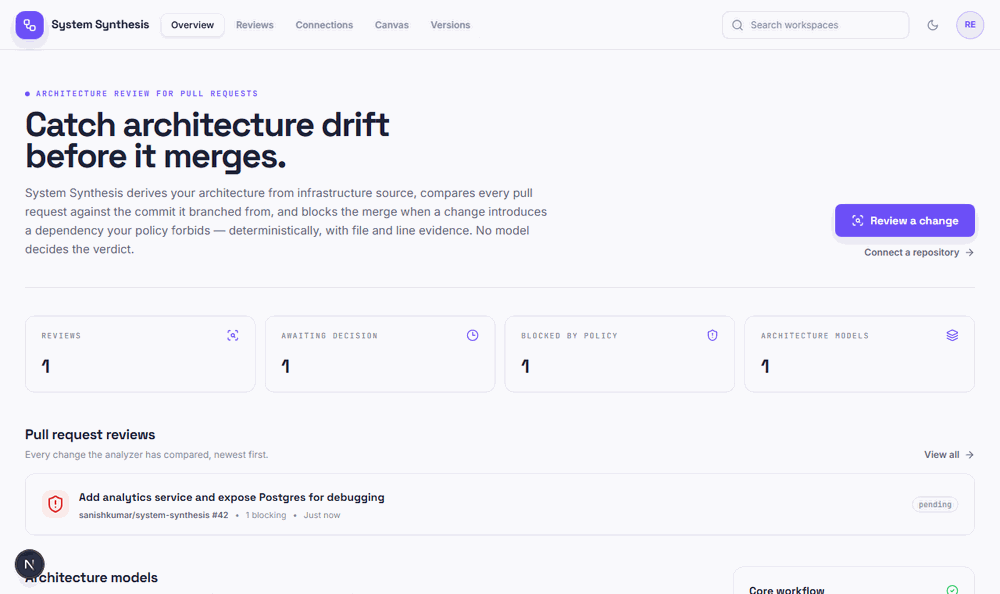
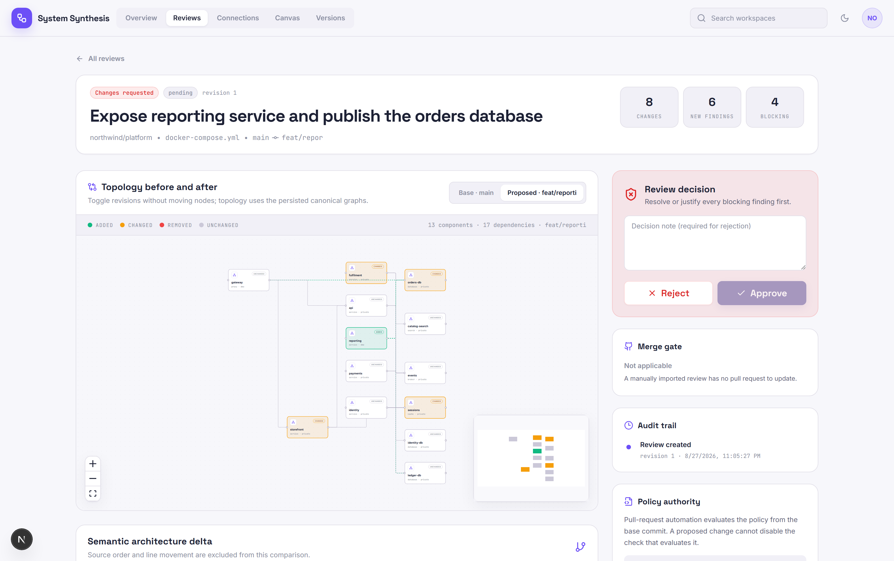
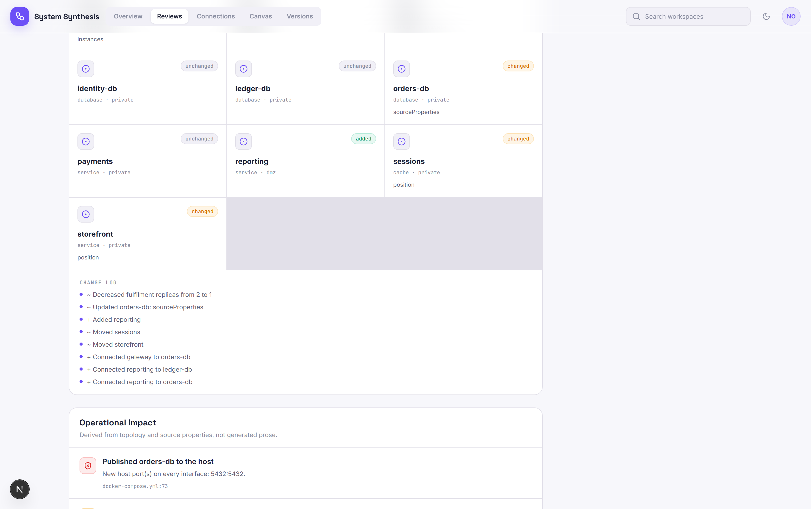
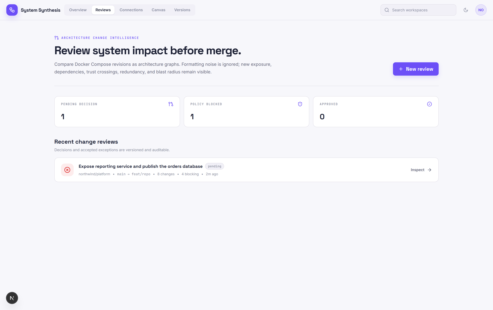
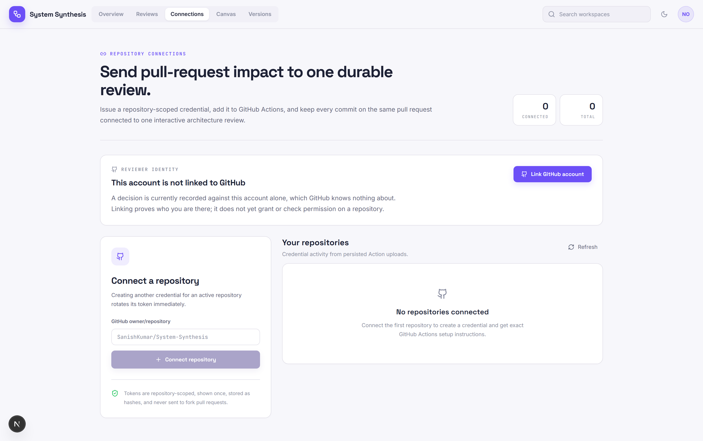
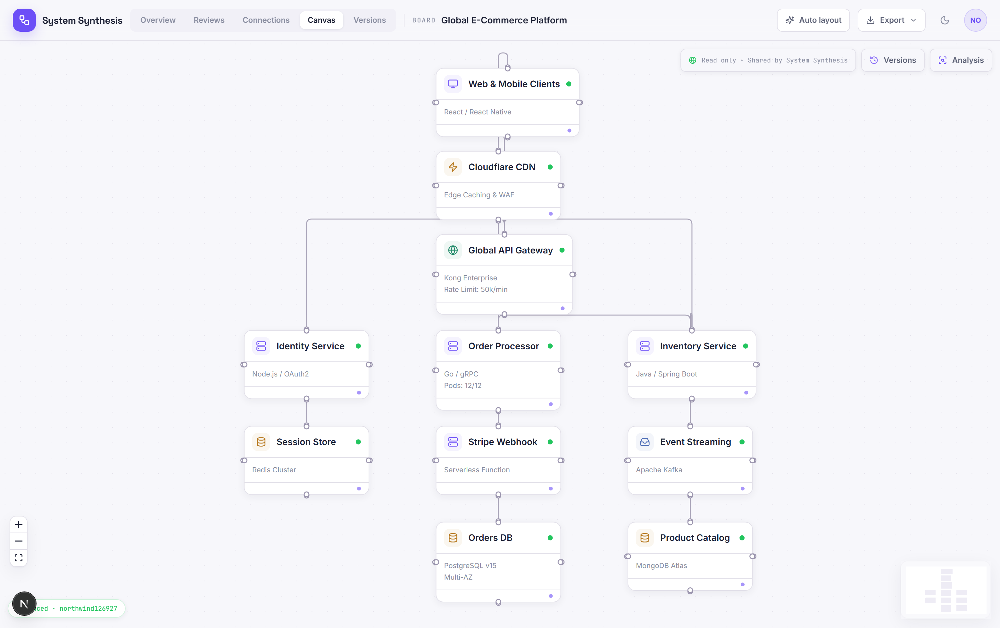
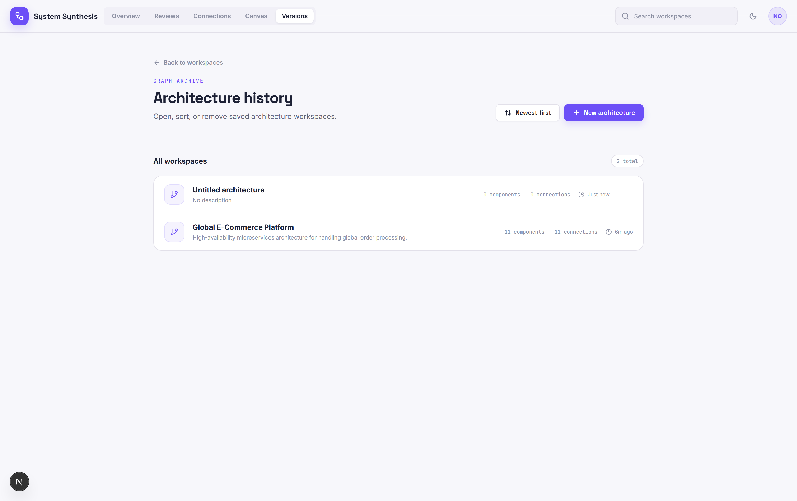
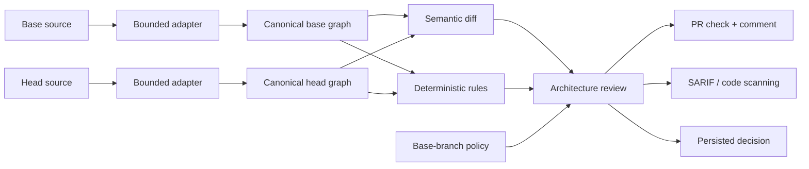

# System Synthesis

**Architecture review for pull requests.** It derives your architecture from infrastructure source, compares every pull request against the commit it branched from, and blocks the merge when a change introduces something your policy forbids — deterministically, with file and line evidence.

No model decides the verdict.

[](https://github.com/SanishKumar/System-Synthesis/actions/workflows/ci.yml)
[](https://nodejs.org)
[](./LICENSE)



---

## The problem

Code review shows text. Architecture changes hide inside it:

- a database that is suddenly published to the host
- a public service that now talks straight to persistence
- a new trust-boundary crossing
- a replica count quietly dropped from 2 to 1
- a blast radius that just got wider

Diagrams drift and never participate in the merge decision. LLM-only review is hard to reproduce and unsafe as a required check.

System Synthesis answers one narrow question, the same way every time:

> **What architecture changed in this pull request, and did it break policy?**

---

## What a review looks like

A pull request adds a reporting service, publishes the orders database to the host, and points the gateway straight at it.



Thirteen components, seventeen dependencies, and the three things that actually changed are marked on the graph. Node positions are held steady between revisions, so you compare structure instead of layout.

### Every change, and what it costs



The change log is derived from the graph, not written by a model — *decreased fulfilment replicas from 2 to 1*, *connected gateway to orders-db*. Each impact carries its evidence: `docker-compose.yml:73`.

### The queue



Every pull request the analyzer has compared, newest first, and what each one is waiting on.

---

## Connect a repository



Connecting issues a repository-scoped credential for GitHub Actions. Tokens are shown once, stored only as hashes, and never sent to fork pull requests.

Deciding a review is bound to a real identity: linking proves which GitHub account you are, and the decision gate checks write access on that repository at the moment you decide. A pull request cannot approve itself.

```yaml
- name: Architecture review
  id: review
  uses: SanishKumar/System-Synthesis@v0.2.0
  continue-on-error: true
  with:
    compose-path: compose.yaml
    policy-path: .system-synthesis/policy.json
    base-revision: ${{ github.event.pull_request.base.sha }}
    head-revision: ${{ github.event.pull_request.head.sha }}
    # Optional: persist an interactive review in the browser.
    ingestion-url: ${{ vars.SYSTEM_SYNTHESIS_INGESTION_URL }}
    ingestion-token: ${{ secrets.SYSTEM_SYNTHESIS_INGESTION_TOKEN }}
```

It is a bundled Node 24 action — consumers install nothing and run no dependency lifecycle scripts.

---

## Model, explore, and keep the history

Alongside the derived reviews there is a collaborative canvas for the architecture you *intend*, separate from what the analyzer reads out of source.



Multiplayer editing, per-user undo, auto layout, and export. Hold <kbd>Ctrl</kbd> (or <kbd>⌘</kbd>) to select several components, or <kbd>Shift</kbd>-drag to draw a selection box; dragging any of them moves the whole selection together. Every workspace keeps its own version history.



---

## Where AI fits

Findings come from the deterministic rule engine. The assistant can *explain* a finding in plain language — it cannot create one, remove one, or change a verdict.

```text
source → canonical graph → deterministic diff + rules → policy → optional explanation
```

That ordering is the product. It is what makes the check safe to mark required.

---

## Try it in two minutes

The analysis needs only a repository and two revisions — no account, no server, no GitHub permission:

```bash
git clone https://github.com/SanishKumar/System-Synthesis
cd System-Synthesis
npm ci
npm run build --workspace=architecture-core
npm run build --workspace=architecture-cli

node architecture-cli/dist/bin.js review \
  --base examples/architecture-review/base/compose.yaml \
  --head examples/architecture-review/head/compose.yaml \
  --source-path compose.yaml \
  --base-revision main \
  --head-revision feature/checkout-db \
  --policy examples/architecture-review/policy.json \
  --format markdown
```

It exits `1`, because the example deliberately publishes a database port and adds a direct dependency on it.

Point it at any project you like — each side is read out of Git history, so nothing has to be extracted first:

```bash
node architecture-cli/dist/bin.js review \
  --repo ../their-project \
  --compose-path docker-compose.yml \
  --base-revision main --head-revision their-branch
```

**Output formats:** `--format json`, `markdown`, `sarif`

| Exit code | Meaning |
| ---: | --- |
| `0` | Valid input; policy passed |
| `1` | Valid input; blocking architecture findings introduced |
| `2` | Invalid command, policy, or source |

---

## How it works


```mermaid
flowchart LR
    Base["Base source"] --> ImportBase["Bounded adapter"]
    Head["Head source"] --> ImportHead["Bounded adapter"]
    ImportBase --> BaseGraph["Canonical base graph"]
    ImportHead --> HeadGraph["Canonical head graph"]
    BaseGraph --> Diff["Semantic diff"]
    HeadGraph --> Diff
    BaseGraph --> Rules["Deterministic rules"]
    HeadGraph --> Rules
    Diff --> Review["Architecture review"]
    Rules --> Review
    Policy["Base-branch policy"] --> Review
    Review --> Check["PR check + comment"]
    Review --> SARIF["SARIF / code scanning"]
    Review --> Browser["Persisted decision"]
```

Identities come from source addresses such as `services.checkout`, never from array order or line number. Line and revision metadata stay as evidence but are excluded from semantic equality, so **reformatting alone produces no architecture change.**

Policy is read from the base commit, so a pull request cannot disable the check that reviews it.

The graph engine computes reachability, strongly connected components, cycles, articulation points, bridges, dependency depth, blast radius, and trust-boundary crossings.

---

## What it reads today

Docker Compose, deliberately bounded:

- services, images, and build context
- published and exposed ports, classified by how far they actually reach
- explicit `depends_on`, short and long form
- dependencies inferred from environment values that name another service, such as `DATABASE_URL: postgres://database:5432/app`
- networks, volumes, secret names, environment variable *names*
- healthcheck presence and replica count

Inferred edges need an exact service-name match and are labelled `inferred`, so you can tell them from declared ones. Environment **values** are read to resolve references and never stored.

It does not claim full Compose evaluation: interpolation, `include`, `extends`, profiles, and override merging are not resolved.

A Kubernetes adapter exists in `architecture-core` and is not yet reachable from the CLI, Action, or server. See [known limitations](./docs/KNOWN_LIMITATIONS.md) — that file is deliberately blunt about what this does not do.

---

## Documentation

| | |
| --- | --- |
| [Architecture change reviews](./docs/ARCHITECTURE_CHANGE_REVIEWS.md) | The review contract, rules, and provenance model |
| [GitHub App setup](./docs/GITHUB_APP_SETUP.md) | Installing the App and connecting a repository |
| [Verified guarantees](./docs/GUARANTEES.md) | Every behavioural claim, and the test that holds it |
| [Known limitations](./docs/KNOWN_LIMITATIONS.md) | What it does not do, in detail |
| [Threat model](./docs/THREAT_MODEL.md) · [Failure model](./docs/FAILURE_MODEL.md) | Trust boundaries and degradation behaviour |
| [Benchmarks](./docs/BENCHMARKS.md) · [ADRs](./docs/adrs) | Measured numbers and the decisions behind the design |

---

## Running it locally

Requires Node.js 20+ and npm. PostgreSQL is needed for durable reviews and history; Redis for multi-instance collaboration. Without either, it runs in memory.

```bash
npm ci
npm run build --workspace=server
```

```bash
# terminal 1 — from the repository root
PORT=4000 NODE_ENV=development FRONTEND_URL=http://localhost:3000 node server/dist/index.js
```

```bash
# terminal 2
npm run dev --workspace=frontend
```

Open <http://localhost:3000>.

### Verification

```bash
npm run verify              # every build and unit suite
npm audit --omit=dev        # production dependency audit
```

---

## Repository map

| Path | Contents |
| --- | --- |
| `architecture-core/` | Source adapters, canonical graph, diff, rules, policy |
| `architecture-cli/` | Standalone review CLI |
| `architecture-action/` | Bundled GitHub Action |
| `server/` | Review persistence, authorization, collaboration, export |
| `frontend/` | Next.js application |
| `examples/` | Reproducible base/head demonstration |
| `docs/` | Contracts, models, limitations, ADRs |

## Non-goals

- Runtime discovery, tracing, or live topology. It reads declared source.
- A general diagramming tool. The canvas supports the review model.
- LLM-authored verdicts. Explanations only, always after the rules.

## Contributing and security

See [CONTRIBUTING.md](./CONTRIBUTING.md) and [SECURITY.md](./SECURITY.md).

## License

[MIT](./LICENSE)
